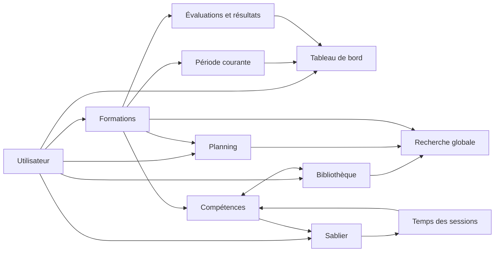
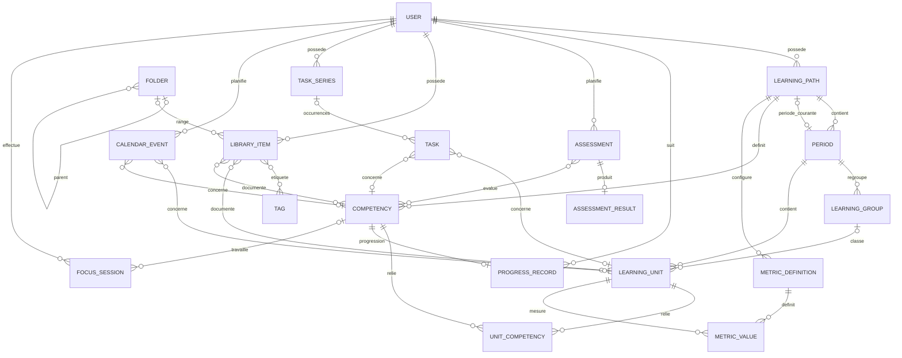
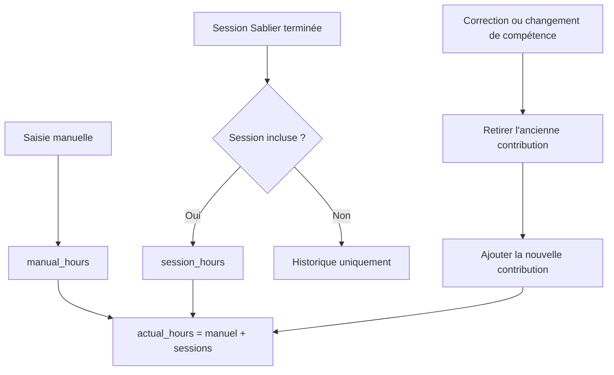

# Plan d’amélioration complet de MyENT

Dernière mise à jour : 12 août 2026  
État : phases 1 à 4 réalisées avant la reprise ; phases 5 à 12 implémentées lors de la reprise.

## Objectif

Faire de MyENT un environnement étudiant personnel cohérent : une donnée n’est saisie
qu’une fois, reste modifiable, appartient toujours au bon compte et mène directement à
l’action suivante. Le module Formations enrichit la bibliothèque, le planning, le
tableau de bord et Sablier sans rendre ces modules dépendants d’une structure scolaire.

## Vue d’ensemble

| Phase | Résultat attendu | État |
|---:|---|:---:|
| 0 | Socle vérifiable : migrations, tests, isolation et règles d’intégrité | ✅ |
| 1 | Toute donnée créée peut être relue, modifiée et supprimée proprement | ✅ |
| 2 | Compétences et ressources reliées dans les deux sens | ✅ |
| 3 | Formation générique : regroupements facultatifs et compétences transversales | ✅ |
| 4 | Évaluations séparées de leurs résultats et moyennes explicables | ✅ |
| 5 | Année/période courante, catalogue, aperçu, import, export et duplication | ✅ |
| 6 | Bibliothèque cherchable, filtrable, paginée et organisée en arborescence | ✅ |
| 7 | Tableau de bord actionnable et situation académique utile | ✅ |
| 8 | Planning académique, vraies séries de tâches et vue semaine | ✅ |
| 9 | Temps manuel/Sablier séparé et sessions corrigeables | ✅ |
| 10 | Mobile, clavier, focus et retours d’état accessibles | ✅ |
| 11 | Recherche complète et réindexation du contexte descendant | ✅ |
| 12 | Sécurité, exploitation, portabilité et documentation | ✅ code / ⏳ préproduction |

## Phases 1 à 4 — fondations terminées

### Phase 1 — cycle de vie complet

- création et modification partagent les mêmes formulaires ;
- retour contextuel et annulation homogènes ;
- suppression confirmée avec résumé de cascade ;
- dossiers, étiquettes, colonnes, périodes, matières et compétences sont modifiables.

### Phase 2 — ressources pédagogiques

- une ressource peut être associée depuis une matière ou une compétence ;
- l’association inverse est possible depuis la bibliothèque ;
- retirer une association ne supprime jamais le fichier ou la note ;
- les ressources sont classées par usage pédagogique, indépendamment de leur format.

### Phase 3 — modèle de formation générique

- les UE/blocs/domaines sont des regroupements facultatifs ;
- une compétence appartient à la formation et peut traverser plusieurs matières ;
- le lien matière–compétence porte l’ordre, le rôle principal et l’objectif local ;
- les formations sans UE conservent une structure simple période → matière.

### Phase 4 — évaluations et résultats

- une évaluation existe avant sa note ;
- son résultat, son barème réel et l’auto-appréciation sont séparés ;
- les compétences évaluées et ressources de préparation sont reliées ;
- les moyennes indiquent leur pondération et leurs réserves ;
- aucune absence n’est silencieusement transformée en zéro.

## Phase 5 — modèles et portabilité des formations

Livré :

- `academic_year` et `current_period` sur chaque formation ;
- période courante visible dans la liste, la formation et le tableau de bord ;
- format public `myent.learning-path`, versionné et validé avant écriture ;
- catalogue avec la L3 Mathématiques de l’Université de Guyane ;
- aperçu chiffré avant création ;
- import JSON en deux étapes, export JSON et duplication indépendante ;
- contrôle des références croisées, des nombres, des clés et des limites de taille ;
- import atomique : une erreur ne laisse aucune formation partielle.

Critère d’acceptation : exporter une formation, la réimporter puis la modifier ne change
ni l’original ni les données d’un autre compte.

## Phase 6 — bibliothèque utilisable à l’échelle

Livré :

- recherche locale visible dans la page ;
- filtres cumulables : dossier, étiquette, format, nature, matière et compétence ;
- tris par modification, création et titre ;
- nombre de résultats et pagination par 24 ;
- un dossier parent inclut ses descendants ;
- fil d’Ariane complet et arborescence visuelle ;
- prévention des cycles directs et indirects de dossiers ;
- formulaire dépendant du format : URL, fichier ou éditeur de note ;
- nettoyage serveur des champs devenus non pertinents ;
- éditeur riche local, sans CDN.

Critère d’acceptation : plusieurs filtres peuvent être combinés sans fuite d’un objet
appartenant à un autre utilisateur.

## Phase 7 — tableau de bord actionnable

Livré :

- tâches terminables directement ;
- événements, rappels, contenus et formations ouvrent leur vraie destination ;
- widget Situation académique : formation active, période courante, compétences acquises,
  moyenne explicable et prochaines évaluations ;
- état vide qui conduit au choix d’une formation ou d’un modèle ;
- réorganisation des widgets à la souris et au clavier.

## Phase 8 — planning relié aux études

Livré :

- tâches et événements rattachables, facultativement, à une matière, une compétence ou
  une évaluation ;
- sélecteurs limités aux données du propriétaire ;
- filtrage du planning et des tâches par formation ;
- vue mois et vraie vue semaine bornée du lundi au dimanche ;
- `TaskSeries` identifie une série indépendamment de son titre ;
- terminer, rouvrir ou supprimer toute une série est une action explicite ;
- une occurrence reste modifiable ou supprimable seule ;
- les relations académiques sont recopiées dans les occurrences.

## Phase 9 — temps traçable

Livré :

- `manual_hours`, `session_hours` et `actual_hours` sont distingués ;
- migration des anciennes données en préservant le total ;
- la grille affiche la part saisie et la part Sablier ;
- historique paginé des sessions ;
- correction de la durée, de la date, de l’intention ou de la compétence ;
- exclusion/réinclusion sans effacer la trace ;
- recalcul transactionnel de l’ancienne et de la nouvelle contribution ;
- lancement depuis une compétence avec 25 minutes, intention, sélection et retour
  préremplis.

Règle : le temps ne détermine jamais automatiquement le niveau de maîtrise.

## Phase 10 — responsive et accessibilité

Livré :

- lien d’évitement vers le contenu ;
- focus visible sur les contrôles ;
- menu mobile refermable par bouton, fond, navigation ou Échap ;
- focus piégé dans le menu ouvert et états ARIA synchronisés ;
- en-têtes, listes, filtres et actions repliables sur petit écran ;
- messages annoncés par une région vivante ;
- déplacement clavier des widgets avec confirmation vocale ;
- respect de `prefers-reduced-motion`.

## Phase 11 — recherche globale fiable

Livré :

- index des ressources, tâches, événements, formations, matières, compétences,
  regroupements, évaluations et résultats ;
- contexte académique dans les tâches et événements ;
- note, barème, commentaire et auto-appréciation dans les résultats ;
- réindexation des descendants après renommage d’une formation, période, UE ou matière ;
- réindexation après changement d’étiquette, de lien matière–compétence ou de compétences
  évaluées ;
- isolation systématique par propriétaire ;
- plein texte français sous PostgreSQL et repli local sous SQLite.

## Phase 12 — production et exploitation

Livré dans le code :

- scripts strictement locaux via CSP ;
- blocage des cadres, objets, caméras, micros, géolocalisation et paiements ;
- identifiant de requête renvoyé dans `X-Request-ID` ;
- `/livez/` pour la vivacité et `/healthz/` pour base + cache ;
- cookies sécurisés, HSTS, redirection HTTPS et clé obligatoire hors débogage ;
- export personnel JSON sans mot de passe ni jeton ;
- export de formation réimportable ;
- tests d’intégrité, de cloisonnement, de navigation et de migration.

À valider en préproduction :

1. exécuter `manage.py check --deploy` avec les secrets réels ;
2. restaurer une sauvegarde PostgreSQL et S3 dans un environnement vide ;
3. tester SMTP, Redis/Celery, S3 privé et les limites du proxy ;
4. parcourir les flux principaux au clavier et sur un téléphone réel ;
5. surveiller erreurs 5xx, latence, profondeur de file et échec des sauvegardes ;
6. promouvoir exactement la même image vers la production.

## Schéma fonctionnel



## Schéma de données principal



## Flux de calcul du temps



## Commandes de validation

```powershell
python src/manage.py check
python src/manage.py makemigrations --check --dry-run
python src/manage.py test accounts.tests core.tests dashboard.tests formations.tests library.tests notifications.tests planner.tests sablier.tests
ruff check src
python src/manage.py check --deploy
```
