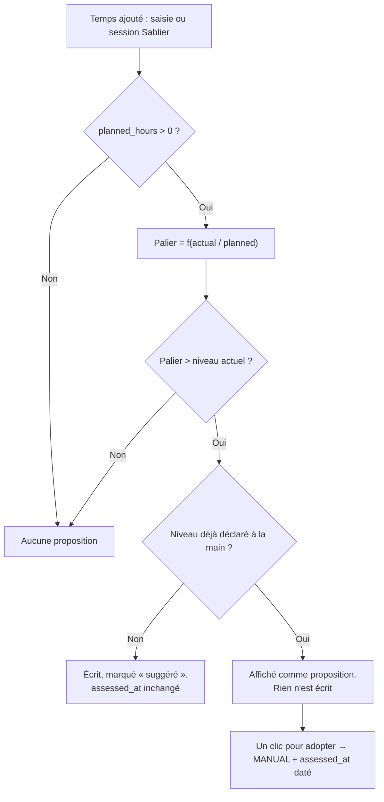

# Plan d’amélioration II — MyENT

Suite de [PLAN_AMELIORATION.md](PLAN_AMELIORATION.md), dont les phases 0 à 12 sont livrées.
Établi le 12 août 2026 à partir de l’audit système et pédagogique.

## Objectif

Deux manques, un par dimension.

Côté système : le code est mûr, la chaîne d’exploitation ne l’est pas. Les risques restants
ne sont plus dans les vues, ils sont dans ce qui se passe la nuit.

Côté pédagogie : le modèle de données décrit une pédagogie plus ambitieuse que ce que
l’interface restitue. `target_level`, `target_date`, `assessed_at` et `Origin.SUGGESTED`
sont saisis, stockés, exportés — et affichés nulle part. Le temps de travail est mesuré au
quart d’heure près ; la maîtrise, elle, est un entier écrasé à chaque écriture.

## Vue d’ensemble

| Phase | Résultat attendu | Dépend de | État |
|---:|---|---|:---:|
| 13 | Chaîne d’exploitation sûre : rien ne démarre en silence sur une base jetable | — | ✅ |
| 14 | Progression par paliers de temps, proposée et jamais imposée | — | ✅ |
| 15 | La maîtrise a une histoire : journal, fraîcheur, courbe | — | ✅ |
| 16 | Objectif restitué, niveaux qualifiés, progression pondérée | 15 | ✅ |
| 17 | Boucle de reprise : l’application ramène vers ce qui a été laissé | 14, 15, 16 | ✅ |
| 18 | Tenue en charge : streaming, réindexation, moyennes | — | ✅ |

Les phases 13 et 18 sont indépendantes des autres et peuvent avancer en parallèle.

Reste à faire hors du code : la validation en préproduction, listée au bas de ce document.

---

## Phase 13 — chaîne d’exploitation

Bloquant avant toute mise en ligne. Aucune de ces corrections ne touche à la logique
métier ; aucune ne devrait modifier un test existant.

### 13.1 Débloquer la CI

`ruff format --check src` échoue sur six fichiers (`core/apps.py`,
`dashboard/tests/test_layout.py`, `formations/models.py`, `library/models.py`,
`library/views.py`, `planner/views.py`) : tout push de la branche échoue avant d’atteindre
les tests. Une commande : `ruff format src`.

### 13.2 Interdire le repli SQLite hors débogage

Sans `DATABASE_URL`, `settings.py` crée une base SQLite dans `src/data/`, répertoire qui
n’est monté sur aucun volume. Une variable oubliée dans Coolify donne une application qui
démarre, fonctionne, accepte des comptes, et perd tout au redéploiement. Le README
l’interdit, rien ne l’applique.

```python
database_url = os.getenv("DATABASE_URL")
if not database_url and not DEBUG:
    raise ImproperlyConfigured("DATABASE_URL PostgreSQL est obligatoire hors débogage.")
```

Symétrique du garde-fou déjà posé sur `SECRET_KEY`, et testable dans `core/tests/test_settings.py`.

### 13.3 Sauvegarder les fichiers, pas seulement la base

`backup_database` fait un `pg_dump` et rien d’autre. Avec `USE_S3=false` — le défaut de
`.env.example` — les fichiers de bibliothèque et les pistes audio vivent dans le volume
Docker `private_media`, jamais sauvegardé, alors que `DEPLOYMENT.md` fait croire l’inverse
en demandant de « restaurer une sauvegarde PostgreSQL et S3 ».

Deux voies, à trancher :

- **imposer S3 en production** : `USE_S3=true` obligatoire, versionnement du bucket
  documenté, et la sauvegarde ne concerne plus que la base ;
- **sauvegarder le volume** : ajouter au script une archive du média vers le bucket de
  sauvegarde, avec la même rétention à trois paliers.

Dans les deux cas, le contrôle de `DEPLOYMENT.md` doit vérifier la restauration **des
deux**, sinon il valide une couverture qui n’existe pas.

### 13.4 Inverser le défaut de `DJANGO_DEBUG`

`.env.example` livre `DJANGO_DEBUG=true`, et `DEPLOYMENT.md` demande de copier ce fichier
dans les secrets Coolify *puis* de corriger la valeur. Une procédure manuelle en deux temps
dont le premier est dangereux. Mettre `false` dans l’exemple, et documenter `true` pour le
développement local.

### 13.5 Voir ce qui échoue

`/healthz/` et `/livez/` existent et sont bien faits, mais rien ne les interroge hors du
`HEALTHCHECK` Docker. À ajouter : collecte des erreurs serveur, et surtout **alerte sur
échec de sauvegarde** — une sauvegarde qui échoue en silence équivaut à une absence de
sauvegarde.

**Critère d’acceptation** : démarrer le conteneur sans `DATABASE_URL` échoue immédiatement
avec un message explicite ; une sauvegarde restaurée dans un environnement vide rend une
application complète, fichiers compris.

---

## Phase 14 — progression par paliers de temps

Le cœur de cette itération.

### Ce qui est demandé

Quand un quart du travail personnel estimé est écoulé, la compétence passe à « Découvert »,
et ainsi de suite jusqu’à « Maîtrisé ». L’utilisateur peut toujours modifier.

### La règle

`actual_hours / planned_hours` — donc temps saisi **plus** temps Sablier, le total que la
grille affiche déjà — détermine un palier :

| Part du temps estimé | Niveau proposé |
|---|---|
| moins de 25 % | 0 · Non abordé |
| 25 % à 50 % | 1 · Découvert |
| 50 % à 75 % | 2 · En cours |
| 75 % à 100 % | 3 · Acquis |
| 100 % et au-delà | 4 · Maîtrisé |

### Cinq garde-fous, et pourquoi

**1. Sans estimation, aucune proposition.** `planned_hours` vaut zéro par défaut sur une
ligne créée d’office par la grille : il n’y a pas de dénominateur, donc pas de palier. Une
compétence qu’on n’a pas estimée ne progresse pas toute seule.

**2. Le palier ne fait que monter.** Jamais redescendre. Sinon corriger une estimation à la
hausse — ce qui arrive constamment quand on découvre qu’un chapitre est plus long que prévu
— rétrograderait une compétence déjà travaillée. Un niveau atteint est acquis à l’affichage,
seul l’étudiant peut le baisser.

**3. Le niveau posé par le temps est marqué `SUGGESTED`.** Le champ `level_origin` existe
déjà, avec exactement ce libellé : « Suggéré, à confirmer ». La grille le montre autrement
qu’un niveau déclaré, et un clic le confirme — il passe alors en `MANUAL`.

**4. Ce que vous avez déclaré n’est jamais défait.** Tant que le niveau n’a jamais été posé
à la main (`assessed_at` vide, ou origine `SUGGESTED`), le palier s’applique tout seul,
comme demandé. Dès que vous en avez posé un vous-même, le palier ne s’écrit plus : il
s’**affiche** comme proposition, à côté du niveau, avec un bouton pour l’adopter. C’est la
seule lecture possible de « l’utilisateur pourra toujours modifier » : si le palier
réécrivait par-dessus, votre correction serait défaite à la session Sablier suivante.

**5. Une suggestion n’horodate pas `assessed_at`.** Ce champ signifie « dernière
autoévaluation ». Le laisser bouger parce que du temps s’est écoulé rendrait la fraîcheur
mensongère — et la phase 15 s’appuie dessus. Seule une confirmation ou une saisie manuelle
le date.



### Où cela se branche

Une seule fonction, `formations.progression.suggest_from_time(record)`, appelée depuis
`ProgressRecord.save()` **après** le recalcul de `actual_hours` déjà présent. Cela couvre
d’un coup la grille de suivi, le formulaire de compétence, l’import et la correction de
session (`sablier.services._adjust_competency_time`, qui passe par `save()`).

Un point de vigilance : `sablier.services.record_session` écrit par
`ProgressRecord.objects.filter(...).update(...)`, ce qui **court-circuite `save()`**. C’est
le chemin le plus courant — une session terminée — et il doit être converti en écriture par
instance sous verrou, sans quoi la fonctionnalité ne se déclencherait justement pas là où
elle a le plus de sens.

### Un interrupteur par formation

`LearningPath.time_suggests_level`, booléen, activé par défaut. Une formation où l’estimation
horaire n’a pas de sens peut couper les paliers sans que l’étudiant ait à ignorer une
proposition par compétence. Migration triviale, aucun impact sur les données existantes :
les enregistrements actuels portent `level_origin = MANUAL` et gardent donc leur niveau.

### Interface

- Grille de suivi (`_tracking_row.html`) : sur une ligne dont le niveau est suggéré, une
  puce « suggéré » à côté du sélecteur et un bouton de confirmation ; sur une ligne à
  niveau déclaré, la proposition apparaît en gris — « le temps travaillé suggère : Acquis ».
- Fiche de compétence : la même information, avec la fraction lisible (« 8 h sur 12 h
  estimées, soit 67 % »).
- Aucune notification, aucun message d’alerte : la proposition se voit là où on travaille.

### Tests

| Cas | Attendu |
|---|---|
| `planned_hours = 0`, 10 h travaillées | aucun changement |
| 24 % puis 25 % du temps | niveau 0, puis niveau 1 marqué suggéré |
| 50 %, 75 %, 100 % | niveaux 2, 3, 4 |
| 300 % du temps | plafonné à 4 |
| Estimation portée de 4 h à 40 h après un palier | le niveau ne redescend pas |
| Niveau déclaré « En cours », temps atteignant 100 % | niveau inchangé, proposition affichée |
| Confirmation d’une suggestion | origine `MANUAL`, `assessed_at` daté |
| Palier appliqué | `assessed_at` inchangé |
| Session Sablier franchissant un palier | niveau proposé appliqué |
| `time_suggests_level = False` | aucun palier |

**Critère d’acceptation** : travailler 3 h sur une compétence estimée à 12 h la fait passer
à « Découvert » sans intervention ; corriger ce niveau à « En cours » le rend définitif —
aucune session ultérieure ne le réécrit.

---

## Phase 15 — la maîtrise a une histoire

`mastery_level` est écrasé à chaque écriture. On ne peut donc ni montrer une courbe, ni
répondre à « où j’en étais il y a un mois », ni distinguer une compétence qui monte d’une
qui stagne. La perception du progrès est le principal moteur du sentiment d’efficacité
personnelle : c’est précisément ce que l’application ne sait pas montrer.

- `ProgressEvent` : compétence, niveau précédent, nouveau niveau, origine, date. Écrit dans
  le `save()` qui horodate déjà `assessed_at` — donc un seul point d’écriture, et il capte
  aussi les paliers de la phase 14, qui deviennent lisibles a posteriori.
- `assessed_at` enfin affiché : sur la fiche de compétence et dans la grille, en clair
  (« autoévalué il y a 4 mois »). Un « Acquis » de novembre ne doit pas se présenter comme
  un « Acquis » d’hier.
- Courbe de progression par formation et par période, alimentée par le journal.
- Le journal entre dans l’export personnel.

**Critère d’acceptation** : après trois mois d’usage, la fiche d’une compétence montre quand
chaque niveau a été atteint, et par quel chemin — déclaré ou suggéré.

---

## Phase 16 — objectif restitué, niveaux qualifiés

- **Restituer l’objectif.** `target_level` et `target_date` sont éditables et exportés,
  `reaches_target` n’apparaît dans aucun template. À afficher sur la fiche, dans la grille et
  dans le widget académique ; à utiliser pour trier ce qui est en retard sur son objectif.
- **Qualifier les cinq niveaux.** Non abordé, Découvert, En cours, Acquis, Maîtrisé n’ont
  aucun critère observable. En autoévaluation non calibrée, la frontière « Acquis / Maîtrisé »
  dérive avec la fatigue, ce qui rend les totaux peu comparables dans le temps — et fausse
  d’autant les paliers de la phase 14, qui s’en servent de point de départ. Un descripteur
  générique par niveau (« Acquis : je sais le refaire seul sur un exercice nouveau ;
  Maîtrisé : je sais l’expliquer et le transposer »), affiché au survol. Le champ
  `UnitCompetency.local_objective` offre le point d’accroche pour une version par matière.
- **Pondérer la progression.** `percent` ramène le niveau à `niveau × 25 %`, et le tableau de
  bord agrège en « acquises / total » : une compétence marginale pèse autant qu’une
  compétence centrale. `UnitCompetency.is_primary` permet déjà une pondération plus honnête.
- **Commenter l’écart estimé / réel.** `planned_hours` et `actual_hours` sont affichés côte à
  côte sans aucun retour. L’estimation de charge s’acquiert par rétroaction ; sans retour,
  elle ne progresse pas. Une phrase suffit — « vous aviez estimé 6 h, vous en êtes à 11 h » —
  sans score ni jugement.

---

## Phase 17 — boucle de reprise

Le manque pédagogique central : l’application enregistre l’état d’une compétence mais ne
ramène jamais vers elle. Tout le socle existe — `assessed_at`, `target_date`,
`Assessment.scheduled_for`, `Reminder`, `TaskSeries`, un `celery beat` déjà en marche.

- **Liste « à reprendre »** sur le tableau de bord : une compétence en dessous de son
  objectif, dont l’autoévaluation date de plus de N semaines, ou dont une évaluation
  approche. Une liste que l’on consulte, pas une notification qui interrompt. Rien ne
  s’ajoute d’office à l’agenda.
- **Fermer la boucle évaluation → niveau.** `struggling_competencies` est bien branchée sur
  la fiche d’évaluation, avant comme après l’épreuve. Mais après une note, rien ne propose
  d’ajuster le niveau déclaré. À la saisie d’un résultat, proposer — sans appliquer — un
  niveau `SUGGESTED` pour les compétences évaluées : c’est le même mécanisme que la phase 14,
  nourri par une autre source, et c’est l’usage pour lequel l’énumération a été écrite.

**Critère d’acceptation** : après un partiel raté, l’étudiant voit, sans avoir rien
cherché, quelles compétences reprendre et avec quelles ressources.

---

## Phase 18 — tenue en charge

À faire avant d’ouvrir des comptes au-delà du cercle actuel.

- **Streaming.** Gunicorn tourne en `--workers=3 --threads=2`, soit six requêtes
  simultanées, et `sablier.audio_stream` sert des pistes jusqu’à 1 Go depuis Python avec un
  délai de 900 s. Trois auditeurs mobilisent la moitié du serveur. Passer par la redirection
  présignée S3 — déjà écrite — ou déléguer au proxy par `X-Accel-Redirect`.
- **Réindexation.** `reindex_dependents` réindexe tous les descendants en synchrone, à raison
  de deux requêtes par objet. Renommer une formation de 200 compétences fait attendre
  l’utilisateur pour plusieurs centaines d’aller-retours. `core.queue.enqueue` existe déjà ;
  et le recalcul des vecteurs se groupe en un seul `UPDATE`.
- **Moyennes.** `period_average` appelle `unit_average` deux fois par matière — la seconde
  fois dans la liste `graded_units`, qui refait exactement le même calcul. Une période de dix
  matières coûte une cinquantaine de requêtes, à chaque affichage du tableau de bord.
- **Redis.** Le cache et le courtier Celery partagent la base 0 : un `cache.clear()`
  effacerait la file de tâches. `/0` pour le courtier, `/1` pour le cache.
- **Verrouillage de connexion.** Le comptage par identifiant seul est un compromis assumé et
  documenté, valable à cette échelle. À reprendre à l’ouverture multi-comptes : un balayage
  sur des identifiants différents n’est aujourd’hui jamais ralenti.

---

## Ce que ce plan ne remet pas en cause

Quatre refus, inscrits dans le code et pas seulement dans une intention, et qui restent la
colonne vertébrale du projet :

1. une absence n’est jamais transformée en zéro ;
2. aucune compensation n’est appliquée d’office ;
3. rien ne conclut sur la validation d’un diplôme ;
4. toute moyenne affiche sa méthode et ses réserves.

Le cinquième — « le temps ne détermine jamais automatiquement le niveau de maîtrise » — est
**amendé par la phase 14, et non abandonné** : le temps *propose* un niveau, il ne le
décide pas. La proposition est identifiée comme telle, elle ne s’impose jamais à une
appréciation déclarée, et elle ne fait pas passer une compétence pour autoévaluée quand
personne ne l’a évaluée. Cette nuance est ce qui sépare un outil qui aide à se situer d’un
outil qui compte les heures à la place de l’étudiant.

La règle du `ROADMAP` sur Sablier — « l’outil doit rester calme, pas devenir un tableau de
bord de performance » — vaut pour l’ensemble de ce plan : proposer sans appliquer, montrer
sans noter, rappeler sans injonction.

## Ce que le code ne peut pas valider

Six phases sont livrées et vérifiées par la suite de tests. Trois points ne se prouvent
qu’en préproduction, avec les vrais secrets :

1. démarrer sans `DATABASE_URL` et vérifier que le conteneur refuse de servir ;
2. exécuter une sauvegarde, restaurer **la base et l’archive média** dans un environnement
   vide, puis ouvrir un fichier privé depuis l’application restaurée ;
3. activer `MEDIA_INTERNAL_LOCATION`, écouter une piste entière et vérifier qu’aucun
   worker n’est immobilisé — puis vérifier que l’emplacement interne du proxy n’est pas
   joignable de l’extérieur.

## Commandes de validation

```powershell
python src/manage.py check
python src/manage.py makemigrations --check --dry-run
python src/manage.py test accounts.tests core.tests dashboard.tests formations.tests library.tests notifications.tests planner.tests sablier.tests
ruff check src
ruff format --check src
python src/manage.py check --deploy
```
